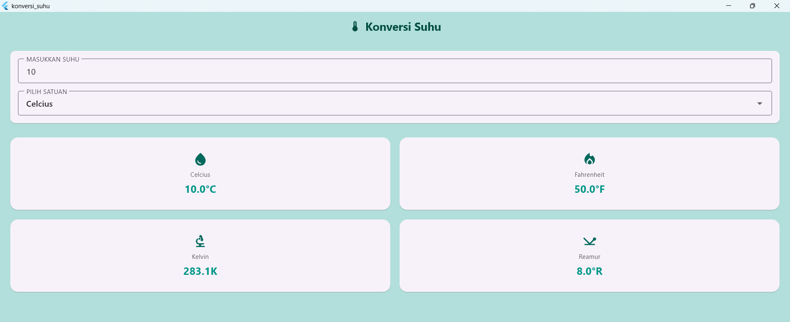

# Konversi Suhu

Aplikasi Flutter sederhana untuk mengonversi suhu antara Celsius, Fahrenheit, Kelvin, dan Reamur.

## Screenshot

  

## Deskripsi
Aplikasi ini memungkinkan pengguna untuk memasukkan suhu dan memilih satuan asal. Aplikasi akan langsung menghitung dan menampilkan hasil konversi ke empat satuan suhu lainnya secara real-time. Desain UI dibuat gepeng (flat) untuk tampilan yang lebih modern.

## Cara Menjalankan Project
1.  Unduh atau clone repository ini.
2.  Buka terminal di folder project ini.
3.  Jalankan perintah `flutter pub get`.
4.  Jalankan perintah `flutter run` untuk melihat hasilnya di emulator.