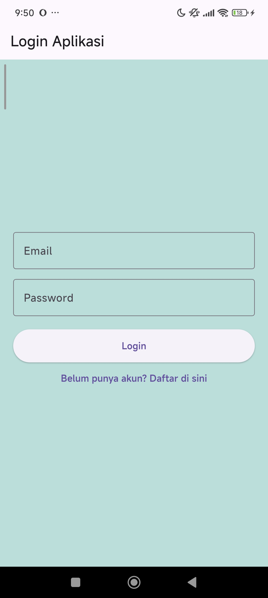

# 🌡️ Aplikasi Konversi Suhu (Flutter + BLoC/Cubit + Firebase Auth)

Aplikasi Flutter sederhana untuk mengonversi suhu antara **Celsius, Fahrenheit, Kelvin, dan Reamur**, yang sudah terintegrasi dengan fitur Login/Register menggunakan **Firebase Authentication**. Aplikasi ini dibangun dengan menerapkan arsitektur *State Management* **BLoC (menggunakan Cubit)** untuk memisahkan secara tegas antara logika bisnis (perhitungan) dan tampilan antarmuka (UI).

**Nama** : Arya Nugraha  
**NRP** : 3124521043  

## Screenshot Aplikasi 📱

  
  &nbsp; &nbsp; &nbsp;
  

